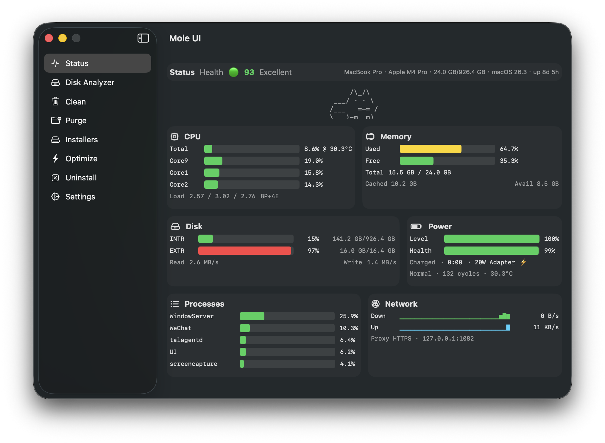

# Mole UI

> **⚠️ Early Development** — This project is in active development and has not been extensively tested. Use Dry Run mode for cleanup operations and please [report any issues](https://github.com/imnotnoahhh/MoleUI/issues).

Native macOS GUI for [Mole](https://github.com/tw93/Mole). Built with SwiftUI, wrapping tw93's Mole CLI tool.



## 📚 Documentation

- **[TODO.md](TODO.md)** - Implementation roadmap and task list
- **[AUTO_UPDATE.md](AUTO_UPDATE.md)** - Auto-update workflow documentation
- **[CONTRIBUTING.md](CONTRIBUTING.md)** - Contribution guidelines
- **[CHANGELOG.md](CHANGELOG.md)** - Version history

## Features

| Feature | CLI Command | GUI Support |
|---------|------------|-------------|
| System Status Monitor | `mo status` | ✅ Real-time Dashboard (JSON mode) |
| Disk Space Analyzer | `mo analyze` | ✅ Visual Analysis (JSON mode) |
| System Cleanup | `mo clean` | ✅ Dry Run Support |
| System Optimization | `mo optimize` | ✅ Dry Run Support |
| Large File Purge | `mo purge` | ✅ |
| Installer Management | `mo installer` | ✅ |
| App Uninstaller | `mo uninstall` | ✅ |
| Touch ID sudo | `mo touchid` | CLI only |
| Shell Completion | `mo completion` | CLI only |
| Self Update | `mo update` | CLI only |
| Uninstall Mole | `mo remove` | CLI only |

## Installation

Download the latest DMG from [GitHub Releases](https://github.com/imnotnoahhh/MoleUI/releases), open it, and drag Mole UI into Applications.

Mole CLI is bundled inside the app, no additional installation required.

## Requirements

- macOS 14.0 (Sonoma) or later

## Build from Source

```bash
# Install just (build runner)
brew install just

# Clone repository
git clone https://github.com/imnotnoahhh/MoleUI.git
cd MoleUI

# Build
just build

# Or open with Xcode
open MoleUI.xcodeproj
```

## Development

```bash
just run              # Build and launch
just clean            # Clean build artifacts
just fmt              # Format code (swiftformat)
just lint             # Lint (swiftlint)
just update-mole      # Update bundled Mole CLI from Homebrew
just info             # Show Swift/Xcode/Mole versions
```

Run tests from Xcode (Cmd+U) or command line:

```bash
xcodebuild -scheme MoleUITests test \
  CODE_SIGN_IDENTITY="-" CODE_SIGNING_REQUIRED=NO CODE_SIGNING_ALLOWED=NO
```

## Contributing

We welcome contributions! Please see [CONTRIBUTING.md](CONTRIBUTING.md) for guidelines on:
- 🎨 UI/UX improvements
- 🧪 Mole CLI compatibility testing
- 🛡️ Stability and bug fixes
- ⚡ Performance optimization

Quick start:
1. Fork the repo and create a feature branch
2. Follow the existing MV architecture — logic in `Model/`, UI in `View/`
3. Run `just fmt && just lint` before committing
4. Open a PR against `main`

## Auto-Update System

MoleUI implements a complete auto-update workflow that automatically detects, validates, and releases new versions when upstream Mole CLI updates. See [AUTO_UPDATE.md](AUTO_UPDATE.md) for details on:
- Automatic compatibility checking
- Auto-merge and auto-release workflow
- Version number synchronization
- User-facing update notifications

## Architecture

Pure MV (Model-View) architecture with Swift's `@Observable` macro:

```
MoleUI/
├── Model/          # @Observable domain models (state + logic)
│   ├── MetricsModel.swift      # System metrics & dashboard data
│   ├── CleanModel.swift        # Cleanup scanning & execution
│   ├── DiskModel.swift         # Disk space analysis
│   ├── OptimizeModel.swift     # System optimization
│   ├── PurgeModel.swift        # Large file purge
│   ├── InstallerModel.swift    # Installer management
│   ├── UninstallModel.swift    # App scanning & uninstall
│   ├── SettingsModel.swift     # Whitelist & preferences
│   ├── VersionModel.swift      # CLI version checking
│   ├── SafetyController.swift  # Confirmation & dry-run
│   ├── CLIExecutor.swift       # Mole CLI process wrapper
│   ├── ErrorTranslator.swift   # User-friendly error mapping
│   └── SudoHelper.swift        # Privilege escalation
└── View/           # Pure SwiftUI views (UI only)
    ├── MoleApp.swift           # @main entry, @Environment injection
    ├── ContentView.swift       # NavigationSplitView layout
    ├── DashboardView.swift     # System status dashboard
    ├── CleanView.swift         # Cleanup interface
    ├── DiskAnalyzerView.swift  # Disk usage visualization
    ├── OptimizeView.swift      # Optimization interface
    ├── PurgeView.swift         # Large file purge interface
    ├── InstallerView.swift     # Installer management
    ├── UninstallView.swift     # App uninstaller
    ├── SettingsView.swift      # Preferences & about
    ├── MoleVersionView.swift   # CLI version display
    └── SidebarView.swift       # Navigation sidebar
```

- Model: `@Observable @MainActor` classes, injected via `.environment()`
- View: reads Model state through `@Environment(XxxModel.self)`
- Swift 6 strict concurrency

## Credits

- [tw93/Mole](https://github.com/tw93/Mole) — Original CLI tool, Mole UI is based on this project
- Built with SwiftUI + NavigationSplitView for native macOS experience

## License

MIT
